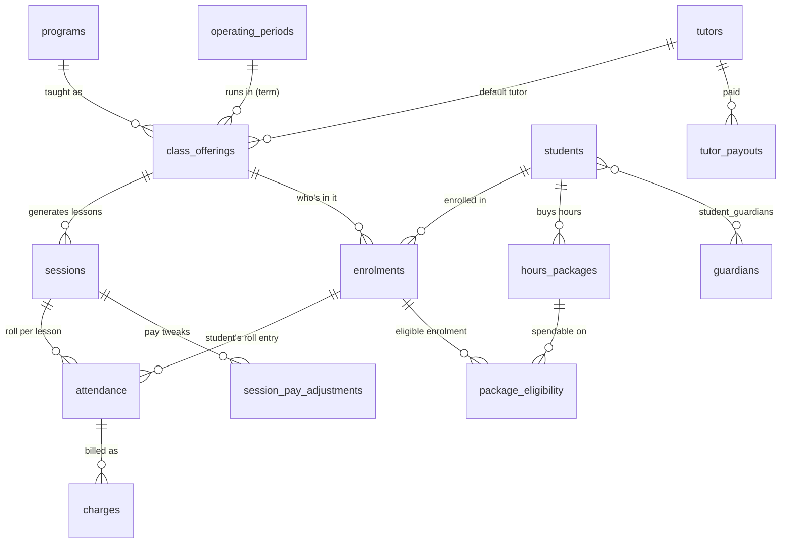

# Vision Admin — Quick SOP

A plain guide to what each section does, what the buttons mean, and what tables exist.

## The sections

| Section | What it's for | Main buttons |
| --- | --- | --- |
| **Today** | The morning glance: who still needs marking, what's on, low hours, what's ready to invoice. | **Present / Absent** on a lesson; **Open the roll**; **Open billing**. |
| **Timetable** | Google-Calendar view of every lesson. Drag to move, drag an edge to resize. | **Day / Week / Month**; density **slider**; click a lesson → panel (below). |
| **Attendance** (Roll) | Mark who turned up, one class at a time. | **✓** present · **✕** away · **Make up** owed a make-up · **All present** · **Make up the class**. |
| **Class Builder** | Make a class. One step; it generates the lessons onto the timetable. | **Create class & generate lessons**; **+ New program**; **Add student**. |
| **Students & Families** | Students and their parents/guardians. | Add student, attach a guardian, set the default payer. |
| **Classes** | Every class, capacity vs enrolled. 1-person classes show the student's name. | **Generate** · **Seed roll** · status. |
| **Enrolments & Hours** | Who's enrolled where, and their hour packages. | Add enrolment; buy/adjust hours. |
| **Billing** | PAYG lessons and packages to invoice; unpaid. | Raise/mark invoices. |
| **Tutor Pay** | Fortnightly pay per tutor from lessons taught. | View/adjust payouts. |
| **Needs Attention** | Anything that looks wrong and needs a human. | Jump to the item. |
| **Setup / Staff** | Programs, terms, prices, tutors; staff access. | Create/edit catalogue; approve staff. |

## The lesson panel (click any lesson on the Timetable)

- **Time, tutor & room** — change start/end, tutor for that lesson, room, notes; cancel or delete.
- **Roll & make-up** — mark the class (**✓ / ✕ / Make up**), **Add a student** to the class, or **Make up the class** (moves the lesson to another day and flags it a make-up).

## Attendance marks

- **✓** — present (this is what spends a student's hours).
- **✕** — away.
- **Make up** — away and owed a make-up.
- Dragging a lesson off its usual slot also marks it a **make-up** (**MU** tag); drag it back to undo.

## How it all connects (the flow)

`Program + Term → Class → generates Lessons → Roll → mark attendance → hours drawn / charges raised → invoicing & tutor pay.`

---

## Database schema

Base tables the app created (**20**):

`access_requests`, `app_settings`, `attendance`, `charges`, `class_offerings`,
`enrolments`, `guardians`, `hours_packages`, `operating_periods`,
`package_eligibility`, `programs`, `session_pay_adjustments`, `sessions`,
`staff`, `standard_prices`, `student_guardians`, `students`, `tutor_pay_rates`,
`tutor_payouts`, `tutors`.

Views (computed, not stored — **8**):
`v_attendance`, `v_charges`, `v_enrolments`, `v_hours_packages`,
`v_needs_attention`, `v_sessions`, `v_session_pay`, `v_tutor_fortnight_pay`.

### Core relationships

### What each core table holds

| Table | Holds |
| --- | --- |
| `students` | A student. |
| `guardians` / `student_guardians` | Parents/payers, and the link to their students. |
| `programs` | What is taught (e.g. Year 8 Maths) — no dates. |
| `operating_periods` | Terms / holiday blocks. |
| `class_offerings` | A class: a program, in a term, with a tutor, capacity, recurrence. |
| `sessions` | The individual lessons generated from a class. |
| `enrolments` | A student in a class, and how they pay (hours / PAYG / trial). |
| `hours_packages` | A block of hours a student bought; drawn down by attendance. |
| `attendance` | One row per student per lesson — present / absent / make-up. |
| `charges` | Money owed for a lesson or package. |
| `standard_prices` | The price list. |
| `tutors` / `tutor_pay_rates` / `tutor_payouts` | Tutors, their rates, and fortnightly pay. |
| `staff` / `access_requests` | Admin accounts and access approvals. |

> Balances, "needs attention", and tutor pay are **computed by the views**, never stored — so they stay correct as rolls are marked.
